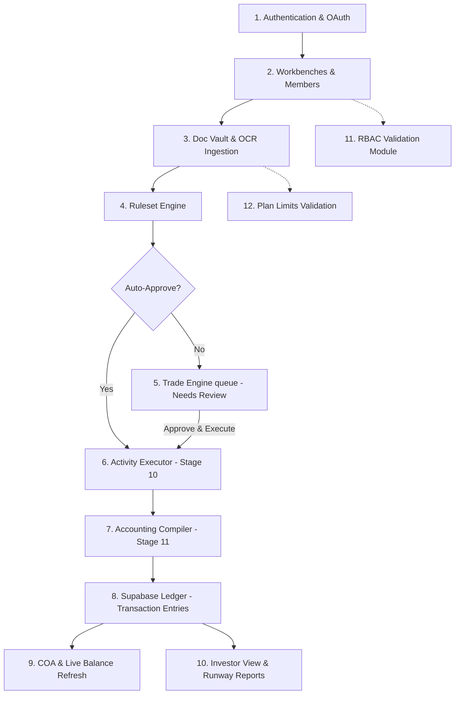

# Dabby Platform: Complete Module Architecture

Below is the full modular breakdown of the Dabby platform, tracking data flow from **Authentication** to **Chart of Accounts (COA)**, **Investor Analytics**, **Role-Based Access Control (RBAC)**, and **Subscription Plans**.

---

---

## 1. Authentication & Session Module (`/Auth`)
*   **Sign Up & Sign In**: Handled via Supabase Authentication (email/password, OAuth callbacks).
*   **Session State**: Managed via React `AuthContext` to persist tokens, current user session, and company-level context.
*   **Protected Routing**: Checks permissions before rendering dashboard modules, ensuring isolated client-side access.

---

## 2. Workbench Module (`/components/Workbenches`)
*   **Workspace Isolation**: High-level separation for different legal entities. All documents, chart of accounts, parties, and ledger tables are partitioned by `workbench_id`.
*   **Member Management**: Supabase row-level security and `workbench_members` define access privileges (owners, consultants, auditors).

---

## 3. Doc Vault Ingestion Module (`/pages/DataIngestion`)
*   **File Uploads**: Drag-and-drop file ingestion interface for PDFs, JPGs, PNGs, and Excel files.
*   **OCR Parsing Queue**: Queues files to Google Cloud Vision API for raw character extraction.
*   **LLM Schema Alignment**: Processes text through a Google Gemini 1.5 Flash structured contract to output:
    *   `document_type` (Vendor Invoice, Sales Invoice, Expense Receipt, Bank Statement, etc.)
    *   Amounts (Gross, Net, Tax/GST)
    *   Parties (detected counterparty, legal address, tax identifiers)
    *   Detailed line-item lists

---

## 4. Rulesets & Automatic Processing Module (`/pages/Rulesets`)
*   **Routing Rules**: Rules defined on variables like `amount`, `party_name`, and `document_type`.
*   **Pipeline Evaluation**: Compares OCR-extracted document data with configured rulesets:
    *   **Pass**: Auto-approve and send directly to execution.
    *   **Fail**: Send to Trade Engine's **Needs Review** queue.

---

## 5. Trade Engine Queue Module (`/pages/TradeEngine`)
*   **Trade Stages**: Trades are organized into four queues: `Needs Review`, `Draft`, `Approved`, and `Rejected`.
*   **Review Panel**: An interactive UI for reviewing and adjusting party relationships, payment vessels (banks/cash accounts), gross vs. net tax splits, and accounting tags.
*   **Error Resolution**: Connects with `TradeResolveModal` on execution failure to guide users on fixing missing or unbalanced accounts.

---

## 6. Activity Executor Module (`/services/activity_executor.py`)
*   **Stage 10 Execution**: Performs operational database updates, such as creating a payable bill, creating a receivable invoice, or recording entity cash/bank balances.
*   **Idempotency Checks**: Prevents duplicate operational document creation on approval retries.

---

## 7. Accounting Compiler Module (`/services/accounting_compiler.py`)
*   **Stage 11 Generation**: Translates executed operations into double-entry ledger entries.
*   **Label Mapping**: Resolves accounts by priority: `activity parameters` → `ruleset map tags` → `Chart of Accounts typed fallbacks`.
*   **Double-Entry Validation**: Enforces that `Debits === Credits`. Discrepancies are safely routed to a Suspense/Clearing account.

---

## 8. Supabase Ledger Module (`/services/ledger_service.py`)
*   **Immutable Transaction Journal**: Writes entries to `transactions` and `transaction_entries` tables.
*   **Journal Integrity**: Once compiled, journal entries cannot be edited, preserving the auditing trail.

---

## 9. Chart of Accounts (COA) Module (`/components/Workbenches/detail/COAView.jsx`)
*   **Account Hierarchy**: Standardizes accounts under Assets, Liabilities, Equity, Revenue, and Expenses.
*   **Dynamic Balances**: The UI calculates balances in real-time from `transaction_entries` by listening for the `refresh-ledger-data` event.

---

## 10. Investor View & Reporting Module (`/pages/InvestorView`)
*   **Financial MRI**: Computes runway, net profit, burn rates, and cash runway projections based on live ledger metrics.
*   **Snapshot Audits**: Exports auditor-ready CSV/PDF reports directly from ledger states.

---

## 11. Role-Based Access Control (RBAC) Module
> [!NOTE]
> **Specification Draft Only — Do Not Implement**
*   **Design Proposal**: Introduces granular role assignments inside `workbench_members` (assigned per workbench).
*   **Defined Roles & Permissions Matrix**:
    *   `Owner`: Full permissions across the workbench, including billing, user inviting, deleting transactions, ruleset writing, and document uploads.
    *   `Accountant`: Can edit drafts, configure the Chart of Accounts, approve trades, and trigger executions. Cannot invite other users or delete workbenches.
    *   `Auditor / Investor`: Read-only access across the entire workbench, including Chart of Accounts, documents, and ledger reports. Cannot execute trades or edit drafts.
    *   `Member / Uploader`: Read-only access to queues and reports. Upload-only access to Doc Vault (cannot view other members' uploaded documents unless approved).

---

## 12. Plan Usage Limits & AI Rate Limiting Module
> [!NOTE]
> **Specification Draft Only — Do Not Implement**
*   **Design Proposal**: Sets up usage limits and query quotas tied to subscription levels.
*   **Defined Tiers & Feature Restrictions**:
    *   **Free Plan**:
        *   Access: Only gets the AI consultant chat interface.
        *   Uploads: 0 document uploads or queue processing.
        *   AI Chat Limit: Max 10 messages / day.
    *   **Go Plan (Seed Tier)**:
        *   Uploads: Max 50 OCR document uploads / month.
        *   Seats: Max 2 workbench members.
        *   AI Chat Limit: Max 100 messages / day.
        *   Features: Suspense fallback auto-routing active, custom rulesets disabled.
    *   **Pro Plan (Growth Tier)**:
        *   Uploads: Max 500 OCR document uploads / month.
        *   Seats: Max 5 workbench members.
        *   AI Chat Limit: Max 500 messages / day.
        *   Features: Custom rulesets, auto-approvals, and multibank ledger support active.
    *   **Enterprise Plan (Scale Tier)**:
        *   Uploads: Unlimited OCR document uploads.
        *   Seats: Unlimited members.
        *   AI Chat Limit: Unlimited messages (high-priority API queue).
        *   Features: Multi-currency consolidation, custom investor audit snapshots.
