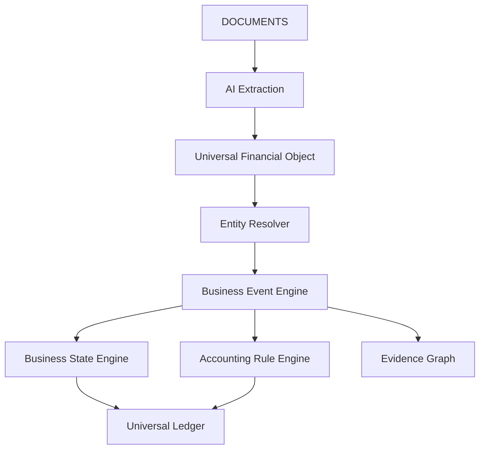

# Dabby Platform Context & Roadmap

This document serves as the master blueprint of where the Dabby architecture currently stands, what is functionally wired to the backend, and what remains to be built to achieve the v1 vision.

---

## The Vision (v1 Roadmap)
We are building a deterministic, modular pipeline that transforms unstructured documents into immutable ledger entries.

```mermaid
flowchart TD
    A[DOCUMENTS] --> B[AI Extraction]
    B --> C[Universal Financial Object]
    C --> D[Entity Resolver]
    D --> E[Business Event Engine]
    E --> F[Business State Engine]
    E --> G[Accounting Rule Engine]
    E --> H[Evidence Graph]
    F --> I[Universal Ledger]
    G --> I
```

---

## 🟢 What We Have Completed (100% Functional)

### Phase 0: AI Extraction & Sync
- **Supabase Realtime Sync:** The Doc Vault accurately reads from the `di_documents` table in Supabase.
- **AI Engine (Groq):** Documents (Bank Statements, Invoices, Receipts) are sent to Groq and extracted into a structured, schema-agnostic JSON format.

### Phase 1: Universal Financial Object (UFO) ✅ *(Just Completed)*
- **The Problem:** The frontend UI and backend pipeline were previously reading raw AI JSON directly. This made the app fragile because AI occasionally hallucinates schema keys (e.g., nesting values under `{ value: '...', confidence: 0.99 }`).
- **The Solution:** We introduced the `UFOMapper` utility in the backend. 
- **Current State:** The AI output is now strictly flattened into deterministic database columns in the `di_analysis_notes` table: `document_type`, `parties`, `money`, `taxes`, `dates`, and `line_items`. The UI (Extracted Data Tab & Snippets Tab) reads perfectly from this reliable UFO contract.

### Foundational UI
- **Dynamic Extracted Data Tab:** Dynamically renders the UFO structure and allows the user to save edits back to Supabase.
- **Snippets Tab:** Parses the `line_items` array (from Bank Statements) and renders verified transaction cards.
- **Internationalization:** Complete dynamic currency formatting (`Intl` API) across the entire platform based on the Workbench's selected country.

---

## 🟡 Structurally Built but Incomplete (UI Mocked)

These features have premium UI components built, but their underlying logic is disconnected or mocked:

1. **"Link Document" Flow (Snippet Cards):** The UI modal to link a snippet to an invoice exists, but it doesn't query actual invoices or push the relational link to Supabase.
2. **Party Analytics Modal:** The charts and metrics (DSO, DPO, LTV) are currently simulated using math formulas rather than aggregating actual ledger data.
3. **Business Engine Pipeline (Kanban):** The beautiful pipeline columns (Identified, Extraction, Verification) use `MOCK_PIPELINE_DATA`. We need to wire this to the `di_documents` table.
4. **Inspector Drawer (Double Entry Ledger):** Clicking a card slides out a proposed Journal Entry, but it uses mock debits/credits rather than the output of our Accounting Rule Engine.

---

## 🚀 What We Need To Do Next

To bridge the gap between our UFO data and the Universal Ledger, we must execute the following phases:

### Phase 2: Entity Resolver (The "Who")
The UFO currently extracts string names (e.g., "AWS" or "Amazon Web Services"). We need an Entity Resolver to map these strings deterministically to an exact `party_id` in the `di_accounts` or `parties` table to prevent duplicate ledgers.

### Phase 3: Business Event Engine (The "What")
This is the heart of the system. We need to connect the `analysis_note_service.py` to the Business Event pipeline. 
- A UFO document must be deterministically classified (e.g., an Invoice becomes a `CUSTOMER_BILLED` event).
- Events are immutable and act as the single source of truth for downstream systems.

### Phase 4: Accounting Rule Engine (The "How")
Once a `CUSTOMER_BILLED` event is fired, the Accounting Rule Engine will determine the debits and credits based on the Chart of Accounts (COA) template. This replaces the mocked Inspector Drawer logic.

### Phase 5: The Universal Ledger
The rules engine posts the debits and credits to the actual `transactions` and `transaction_entries` tables, officially impacting the company's financial state.
